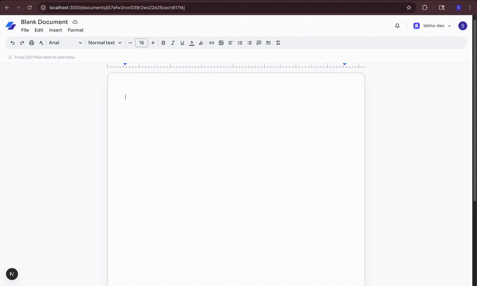

# Lekha

AI-powered collaborative document editor with real-time presence, data visualization, and intelligent commands.

## Demo

<!-- Add your demo video/gif here -->


## Features

### Core
- Real-time collaboration with live cursors and comments
- Rich text editing with tables, images, code blocks, and formatting
- Document templates and organization-based access

### AI Commands
| Command | Description |
|---------|-------------|
| `/lekha <prompt>` | Generate content with AI |
| `/search <query>` | Web search with inline results |
| `/viz <prompt>` | Create data visualizations from CSV |
| `/chart <prompt>` | Generate Mermaid flowcharts and diagrams |
| `/todo <task>` | AI-powered task planning |

### Data Visualization
- Upload CSV files and create charts with natural language
- Use `@filename` to target specific datasets: `/viz @sales.csv revenue by region`
- Chart types: Bar, Line, Area, Pie, Scatter, Tables
- Auto-analyzes data structure for smart suggestions

### Diagrams
- Generate flowcharts, sequence diagrams, and more with `/chart`
- Powered by Mermaid.js

## Tech Stack

| Layer | Technologies |
|-------|-------------|
| Framework | Next.js 15, React 18, TypeScript |
| Backend | Convex (database + functions) |
| Real-time | Liveblocks (presence, cursors, comments) |
| Auth | Clerk (users + organizations) |
| Editor | TipTap (ProseMirror) |
| AI | OpenAI GPT-4o-mini, Vercel AI SDK |
| Visualization | json-render, Recharts, Mermaid |
| UI | Tailwind CSS, shadcn/ui, Radix |

## Quick Start

```bash
npm install
```

Create `.env.local`:

```env
NEXT_PUBLIC_CONVEX_URL=
NEXT_PUBLIC_CLERK_PUBLISHABLE_KEY=
CLERK_SECRET_KEY=
LIVEBLOCKS_SECRET_KEY=
OPENAI_API_KEY=
TINYFISH_API_KEY=
```

Run development server:

```bash
npx convex dev   # Terminal 1
npm run dev      # Terminal 2
```

## License

MIT
