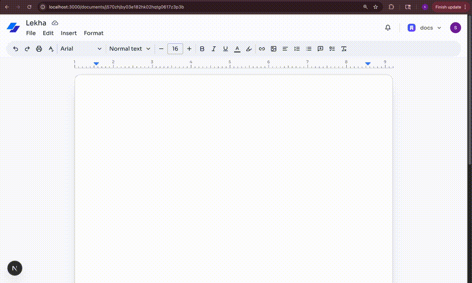

# Lekha

Collaborative document editor with real-time presence, templates, and rich text editing.

## Demo



## Highlights

- Real-time collaboration with cursors and comments (Liveblocks)
- Rich text editing with TipTap, tables, images, and formatting
- Auth + orgs with Clerk
- Documents, templates, and search

## Stack

Next.js 15, React, TypeScript, Convex, Liveblocks, Clerk, Tailwind, shadcn/ui.

## Quick start

```bash
npm install
```

Create `.env.local`:

```env
NEXT_PUBLIC_CONVEX_URL=
NEXT_PUBLIC_CLERK_PUBLISHABLE_KEY=
CLERK_SECRET_KEY=
LIVEBLOCKS_SECRET_KEY=
OPENAI_API_KEY=
TINYFISH_API_KEY=
```

```bash
npm run dev
```

Editor commands:
- `/lekha <prompt>`: generate with OpenAI
- `/search <query>`: web search with Tinyfish
